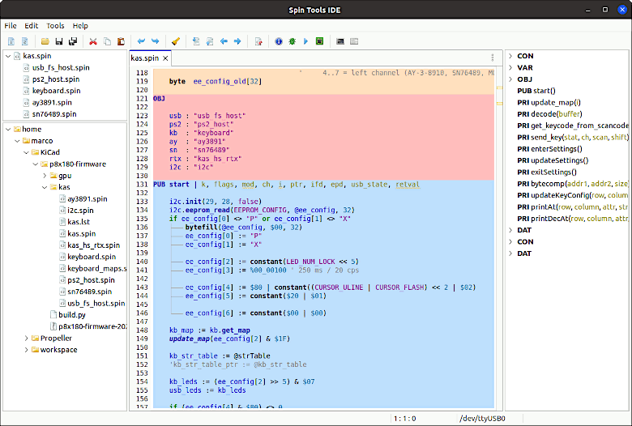

## Spin Tools

Integrated Development Environment for the Parallax Propeller 1 and 2 multicore microcontrollers.

  

**Features:**

 * Source code editor with syntax highlight
 * Code outline and navigation
 * Code assist with linked object inspection
 * Realtime compile
 * TTY, Parallax or ANSI terminal
 * P2 debug support (partial)
 * Includes a set of libraries and examples ready to use
 * Multiplatform, available for Linux, Windows and MacOS

 **Note:** requires Java SE 17 or later runtime already installed.
 
